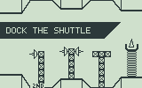
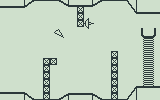
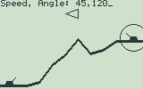
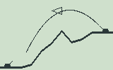
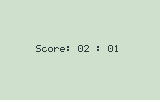

Games for the TI-89 graphing calculator
=======================================

Source for three simple games for the Textas Instruments TI-89 graphing calclator.

* **Spacedock**
 
  Hone your zero-gravity maneuvering skills and try to dock the shuttle without crashing.

   

  **Controls:** *Use arrows to control movement, ``ENTER`` to pause, and ``ESC`` to exit the game.*

* **Castles**
 
  Destroy the castle of your opponent, taking into account the wind,elevation, and terrain. Two-player game.

   

  **Controls:** *To fire a shot, enter speed,angle and press ``ENTER``. ``CLEAR`` to regenerate terrain,
  ``ESC`` to exit.*

* **Pong**

  My first TI-89 game - two-player Pong. Primitive but playable.

   

  **Controls:** *First player - ``X`` and ``=``; Second player: ``^`` and ``÷``.*

To download the compiled games directly, visit the project site at http://avtanski.net/projects/ti/index.html.